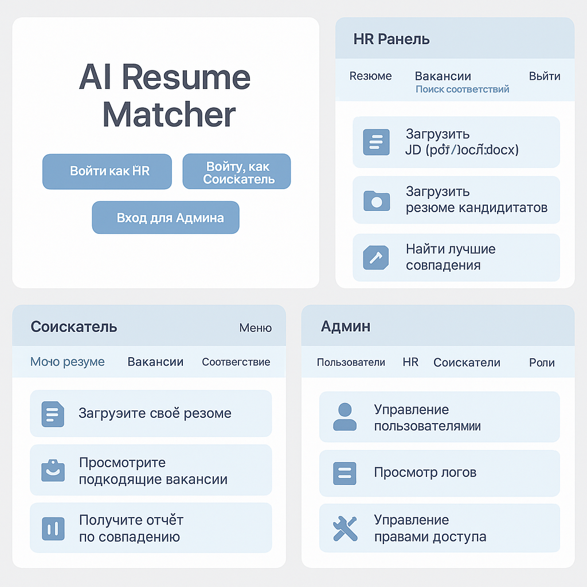

# AI Resume Matcher

AI Resume Matcher — это веб-приложение, которое анализирует соответствие резюме определенной вакансии с использованием современных технологий обработки естественного языка (NLP) и искусственного интеллекта (AI).

## Цели проекта

- Помощь HR-специалистам в отборе кандидатов
- Подсказки соискателям по улучшению резюме
- Автоматизация анализа текста

## Стек технологий

### Backend
- Python
- FastAPI
- spaCy, Sentence Transformers
- PostgreSQL
- Docker

### Frontend
- React
- TailwindCSS

## Основные функции

- Загрузка резюме и вакансий
- Извлечение и сравнение текста
- Анализ совпадений (навыки, опыт, образование)
- Генерация рекомендаций и писем
- Роли: HR, соискатель, админ

## Как запустить проект

bash
# Клонировать репозиторий
git clone https://github.com/balabiturembekov/ai_resume_matcher.git
cd ai_resume_matcher

# Настройка и запуск backend
cd backend
python -m venv env
source env/bin/activate  # Windows: env\Scripts\activate
pip install -r requirements.txt
uvicorn app.main:app --reload

# Настройка frontend (если используется)
cd ../frontend
npm install
npm run dev

## Контейнеризация (Docker)

bash
docker-compose up --build

## Автор

Разработчик и заказчик: Турембеков Балаби